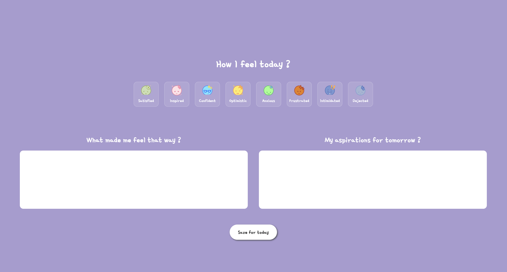

# ✨Daily Developer Feelings Entry

A personal journaling application designed specifically for developers at the start of their coding journey.
This project allows users to track their daily emotions, reflect on their experiences, and visualize their growth over time.

The goal is to create a safe, structured space where developers can acknowledge challenges, celebrate wins, and better understand their emotional patterns throughout learning to code.

This project was inspired by [DailyFeelings](https://github.com/Btelgeuse/DailyFeelings), including the design but the overall logic for future features were thought out by me.

## 📸 Screenshot 



> see live preview <a href="https://journary-entries.netlify.app/">here</a>

## ✨ Project Overview

The Daily Developer Feelings Journal enables users to:
- Register or log in using their email
- Select an emotion they are feeling on a given day
- Write a short reflection explaining why they felt that way
- Save entries to a database
- View all of their past entries in a personalized dashboard
- Each user’s data is private and tied directly to their email address.

## 🎯 Target Audience

This project is built for developers who are beginning their developer journey, including:

- Coding bootcamp students
- Self-taught developers
- Early-career engineers
- Anyone learning to code and navigating emotional ups and downs

## 🌟 Planned Features

Here’s what I envision for the full experience as I grow:

### 💬 Entry System
- [x] Emotion buttons with hover states
- [x] Click to activate one or more emotions
- [x] Text fields for:
  - "Why I felt this way"
  - "My goal for tomorrow"
- [ ] Save entries to local storage or database

### 🎨 Interactive UI
- [x] Typing text animation on the homepage with dynamic background colors
- [x] Emotion-based color palette
- [x] Accessibility-friendly layout and color contrast

### 📅 Dashboard View
- [ ] `dashboard.html` page showing all past entries by date
- [ ] Click a past entry to view your thoughts from that day
- [ ] Past entries displayed in a layout similar to the new-entry form 

### 🔐 Authentication
- [ ] User registration with email and password
- [ ] Secure login system
- [ ] Each user only has access to their own entries

### 🧠 Multi-Emotion Support
- [x] Allow selecting more than one emotion at once
<br/>


## 🚀 Tech Stack

- **HTML** – for structure
- **CSS** – for layout and styling
- **JavaScript** – for interactivity (being learned and added gradually)
<br>

## 💡 How to Use / Run Locally
1. Clone the repo:
 ```bash
   git clone https://github.com/yarlinlynn/Daily-Developer-Feelings-Entry.git
   cd Daily-Developer-Feelings-Entry
```

2. Open ```index.html``` in your browser to see the homepage.
3. Navigate to ```assets/pages/new-entry.html``` to try the emotion selector.

<br>

## 💡 Purpose & Vision

Learning to code is emotionally demanding.
This project exists to remind developers that their feelings are valid, growth isn’t linear, and reflection is a powerful learning tool.

The long-term vision is to create a supportive journaling platform that grows alongside developers as they grow in their careers.

## 🧪 Status

🚧 Active Development


## 📖 License
MIT License
<br>

> Thanks for checking out this project! ✨
